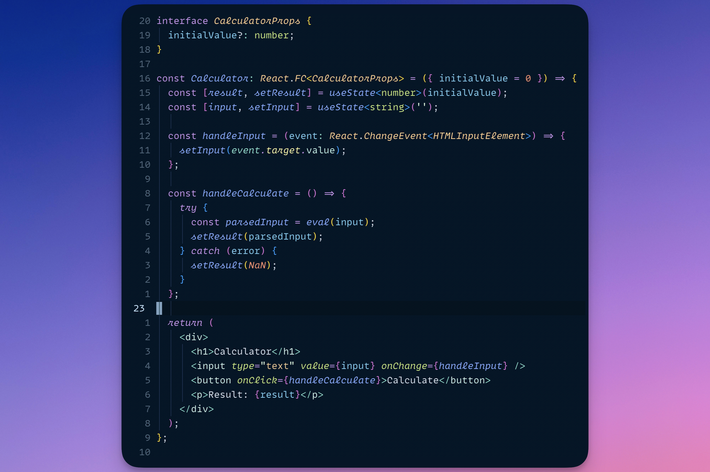

<div align="center">
    <h1>🦉 night-owl.nvim 🌌</h1>
</div>

<div align="center">
    
</div>

The _best_ implementation of
[Sarah Drasner's Night Owl VSCode theme](https://github.com/sdras/night-owl-vscode-theme)
for Neovim with Treesitter support.



## 📦 Install In Zero Time

### Packer

```lua
use("oxfist/night-owl.nvim")
```

### vim-plug

```vim
Plug 'oxfist/night-owl.nvim'
```

## 🚀 Start Using With A Single Line

Add the following line to your Lua configuration files, e.g.
`~/.config/nvim/init.lua` (your actual path might be different):

```lua
vim.cmd.colorscheme("night-owl")
```

To enable `night-owl` for Lualine, simply set the theme like this in your
settings 👇:

```lua
-- This Lualine config should be somewhere in your config files
require('lualine').setup {
  options = {
    -- ... other configs
    theme = 'night-owl'
    -- ... other configs
  }
}
```

## 🖥️ Requirements

TODO

## 🔎 Comparison

How does this port compare to the original VSCode theme? Check it out!

| Original Night Owl for VSCode                                                | This Theme 🤩                                                              |
| ---------------------------------------------------------------------------- | -------------------------------------------------------------------------- |
|  |  |

## ✨ Why Should _I_ pick _this_ version of Night Owl?

This implementation of Night Owl solves syntax highlight issues and
discrepancies similar ports have when contrasting against the original VSCode
theme.

The following features allow making the programming experience as close to the
original VSCode theme as possible:

1. **Extended default highlight group**: through additional Treesitter queries.
   See [`after/queries`](./after/queries) for details.
2. **Different background color when Neovim is inactive**: through autocommands.
   See [`after/plugin/autocmds.lua`](./after/plugin/autocmds.lua) for details.

<details>
<summary>👇 Click to see comparison with <code>haishanh/night-owl.vim</code></summary>

With Treesitter installed you can see the overall look and feel is significantly
different:

- Different colors for several keywords like `let`, `const`, `async`,
  `function`, etc. Same happens for class names `EditFishForm` and `Sale`.
- Italics _not_ applied anywhere except for comments.
- Italics _incorrectly_ applied to JSDoc keywords `@param` and `@returns`.
  <br />

| [haishanh/night-owl.vim](https://github.com/haishanh/night-owl.vim)             | This Theme                                                                 |
| ------------------------------------------------------------------------------- | -------------------------------------------------------------------------- |
|  |  |

</details>

### Language Support 🌐

<table>
  <tr>
    <td></td>
    <td></td>
    <td></td>
    <td></td>
    <td></td>
  </tr>
  <!-- <tr> -->
  <!--   <td></td> -->
  <!--   <td></td> -->
  <!--   <td></td> -->
  <!--   <td></td> -->
  <!--   <td></td> -->
  <!-- </tr> -->
</table>

> I've personally optimized the styling and robustness for these languages
> extensively enough to consider they look _acceptable_ for me to invite you to
> use this colorscheme, if happen to build software with them.

**Coming Soon**: Lua ✅, Vimscript (in progress), Rust, Python, Ruby, Bash, and
many more!

## 🧩 Plugins Supported

- [nvim-treesitter](https://github.com/nvim-treesitter/nvim-treesitter)
- [nvim-tree](https://github.com/nvim-tree/nvim-tree.lua)
- [lualine.nvim](https://github.com/nvim-lualine/lualine.nvim)

## 🎇 Credits

- [Sarah Drashner](https://github.com/sdras) first and foremost, for creating
  such a beautiful and artistic color scheme that has, personally, made so much
  more _pleasurable_ the exhilirating act of building software.
- <https://www.monolisa.dev/> for one of the sweetest programming font out
  there.
